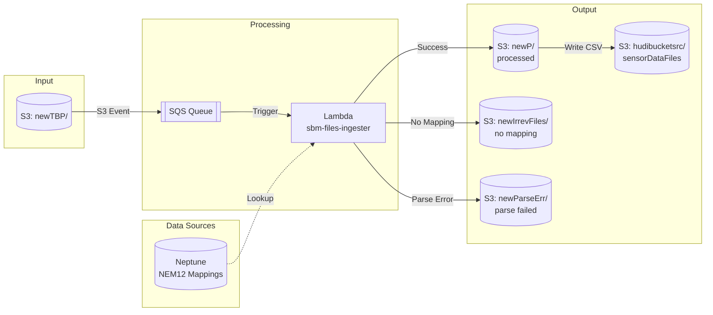

# sbm-ingester


Serverless file ingestion pipeline for building energy data. Processes NEM12/NEM13 meter data files and transforms them into a standard format for the SBM data lake.

## Table of Contents

- [Background](#background)
- [Install](#install)
- [Usage](#usage)
- [Architecture](#architecture)
- [Configuration](#configuration)
- [Testing](#testing)
- [Deployment](#deployment)
- [API](#api)
- [Maintainers](#maintainers)
- [Contributing](#contributing)
- [License](#license)

## Background

SBM Ingester is part of the Sustainable Building Manager (SBM) platform. It handles automated ingestion of energy meter data from multiple sources:

- **NEM12** - Australian interval meter data (30-minute intervals)
- **NEM13** - Accumulation meter data
- **Envizi** - Water and electricity CSV exports
- **Optima** - Generation data and usage reports
- **Green Square ComX** - Schneider private wire meters

Files uploaded to S3 trigger an event-driven pipeline that parses, transforms, and maps meter readings to Neptune graph database sensor IDs.

## Install

**Prerequisites:**
- Python 3.13+
- [uv](https://docs.astral.sh/uv/) package manager
- AWS CLI configured with credentials
- Terraform 1.0+ (for infrastructure)

```bash
# Clone repository
git clone <repository-url>
cd sbm-ingester

# Install dependencies
uv sync --all-extras

# Setup git hooks (optional but recommended)
./scripts/setup-lefthook.sh
```

**Git Hooks:** The project uses [lefthook](https://github.com/evilmartians/lefthook) for automated code quality checks. See [docs/LEFTHOOK.md](docs/LEFTHOOK.md) for details.

## Usage

### Local Development

```bash
# Run linter
uv run ruff check .

# Auto-fix lint issues
uv run ruff check --fix .

# Format code
uv run ruff format .

# Run tests
uv run pytest

# Run tests with coverage
uv run pytest --cov=ingester/src --cov-report=term-missing
```

### Manual File Processing

Upload files to S3 to trigger processing:

```bash
aws s3 cp meter_data.csv s3://sbm-file-ingester/newTBP/
```

### Refresh NEM12 Mappings

```bash
curl -X GET "https://<api-id>.execute-api.ap-southeast-2.amazonaws.com/prod/nem12-mappings" \
  -H "x-api-key: <your-api-key>"
```

## Architecture



### Lambda Functions

| Function | Runtime | Timeout | Purpose |
|----------|---------|---------|---------|
| `sbm-files-ingester` | Python 3.13 | 120s | Main processor - parses files, maps NMIs, writes to data lake |
| `sbm-files-ingester-redrive` | Python 3.13 | 600s | Re-triggers stuck files in `newTBP/` |
| `sbm-files-ingester-nem12-mappings-to-s3` | Python 3.9 | 60s | Hourly job - exports NEM12→Neptune ID mappings |

### File Processing Outcomes

| Outcome | Destination | Description |
|---------|-------------|-------------|
| Success | `newP/` | Parsed successfully and mapped to Neptune ID |
| No Mapping | `newIrrevFiles/` | Parsed but no Neptune ID found |
| Parse Error | `newParseErr/` | Failed to parse with any parser |

## Configuration

### Environment Variables

| Variable | Description | Default |
|----------|-------------|---------|
| `BUCKET_NAME` | Input S3 bucket | `sbm-file-ingester` |
| `BATCH_SIZE` | DataFrames to buffer before S3 write | `50` |

### CloudWatch Log Groups

| Log Group | Purpose |
|-----------|---------|
| `sbm-ingester-execution-log` | Processing start/end timestamps |
| `sbm-ingester-error-log` | Application errors |
| `sbm-ingester-parse-error-log` | File parsing failures |
| `sbm-ingester-runtime-error-log` | Non-parse runtime issues |
| `sbm-ingester-metrics-log` | Daily metrics (file counts, monitor points) |

### AWS Resources

- **Region:** ap-southeast-2
- **S3 Buckets:** `sbm-file-ingester` (input), `hudibucketsrc` (output)
- **SQS:** `sbm-files-ingester-queue` (300s visibility), `sbm-files-ingester-dlq` (14 day retention)
- **DynamoDB:** `sbm-ingester-idempotency` (duplicate prevention)
- **Neptune:** NEM12 ID → sensor ID mappings
- **SNS:** `sbm-ingester-alerts` (error notifications)

## Testing

Tests use pytest with moto for AWS mocking.

```bash
# Run all tests
uv run pytest

# Run with verbose output
uv run pytest -v

# Run specific test file
uv run pytest ingester/tests/test_nem_adapter.py

# Run with coverage report
uv run pytest --cov=ingester/src --cov-report=html
```

### Test Coverage

| Module | Coverage |
|--------|----------|
| `gemsDataParseAndWrite.py` | 100% |
| `modules/nem_adapter.py` | 100% |
| `modules/nonNemParserFuncs.py` | 100% |
| `modules/common.py` | 100% |

## Deployment

Deployment is automated via GitHub Actions on push to `main`.

### Manual Deployment

```bash
# Build Lambda packages
cd ingester
zip -r ../ingester.zip src/

# Upload to S3
aws s3 cp ingester.zip s3://gega-code-deployment-bucket/sbm-files-ingester/

# Update Lambda
aws lambda update-function-code \
  --function-name sbm-files-ingester \
  --s3-bucket gega-code-deployment-bucket \
  --s3-key sbm-files-ingester/ingester.zip
```

### Infrastructure (Terraform)

```bash
cd iac
terraform init
terraform plan
terraform apply
```

## API

### GET /nem12-mappings

Manually triggers NEM12 mapping refresh.

**Request:**
```bash
curl -X GET "https://<api-id>.execute-api.ap-southeast-2.amazonaws.com/prod/nem12-mappings" \
  -H "x-api-key: <api-key>"
```

**Response:**
```json
{
  "statusCode": 200,
  "body": "Mappings refreshed successfully"
}
```

**Rate Limit:** 500 requests/day

## Maintainers

- [@zeyu-chen](https://github.com/zeyu-chen)

## Contributing

1. Create a feature branch from `main`
2. Make changes following the code style (enforced by ruff)
3. Add tests for new functionality
4. Ensure all tests pass: `uv run pytest`
5. Ensure lint passes: `uv run ruff check .`
6. Submit a pull request

## License

Proprietary © GEG
