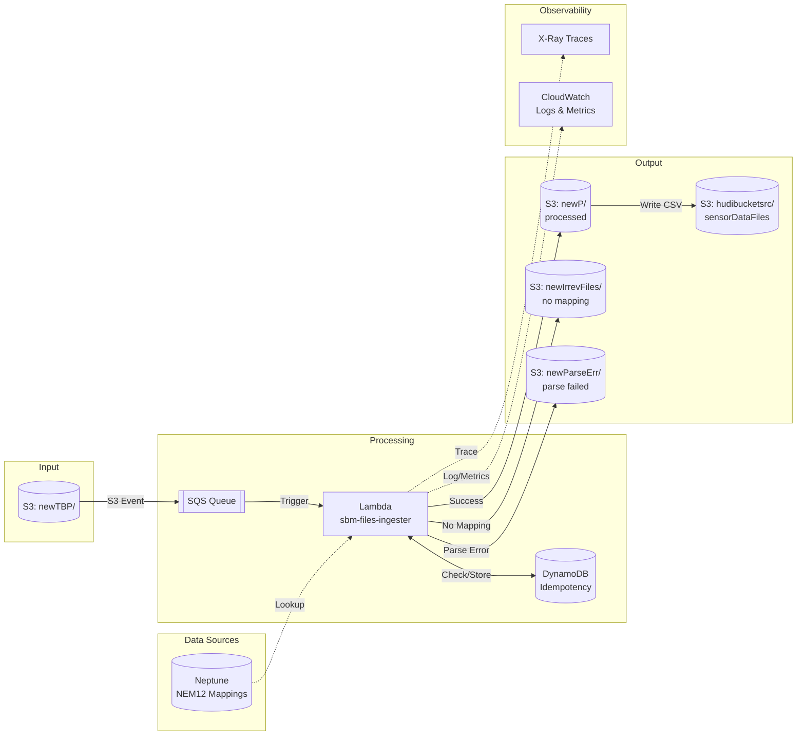

# sbm-ingester


Serverless file ingestion pipeline for building energy data. Processes NEM12/NEM13 meter data files and transforms them into a standard format for the SBM data lake.

## Table of Contents

- [Background](#background)
- [Install](#install)
- [Usage](#usage)
- [Architecture](#architecture)
- [Project Structure](#project-structure)
- [Scripts](#scripts)
- [Configuration](#configuration)
- [Testing](#testing)
- [Deployment](#deployment)
- [API](#api)
- [Maintainers](#maintainers)
- [Contributing](#contributing)
- [License](#license)

## Background

SBM Ingester is part of the Sustainable Building Manager (SBM) platform. It handles automated ingestion of energy meter data from multiple sources:

- **NEM12** - Australian interval meter data (30-minute intervals)
- **NEM13** - Accumulation meter data
- **Envizi** - Water and electricity CSV exports
- **Optima** - Generation data and usage reports
- **Green Square ComX** - Schneider private wire meters

Files uploaded to S3 trigger an event-driven pipeline that parses, transforms, and maps meter readings to Neptune graph database sensor IDs.

### Key Features (v0.5.0)

- **AWS Lambda Powertools** - Structured JSON logging, CloudWatch metrics
- **X-Ray Tracing** - Optional distributed tracing (enabled per Lambda)
- **Idempotency** - DynamoDB-backed duplicate processing prevention
- **Batch Processing** - Configurable buffer size for optimized S3 writes
- **Weekly Archiving** - Automated S3 file archiving with concurrent processing (50 workers)
- **File Stability Check** - Prevents processing of partially uploaded streaming files
- **Glue ETL Pipeline** - Apache Hudi data lake integration with automated batch import
- **Optima Exporter** - Automated BidEnergy data export with detailed error diagnostics

## Install

**Prerequisites:**
- Python 3.13+
- [uv](https://docs.astral.sh/uv/) package manager
- AWS CLI configured with credentials
- Terraform 1.0+ (for infrastructure)

```bash
# Clone repository
git clone <repository-url>
cd sbm-ingester

# Install dependencies
uv sync --all-extras

# Setup git hooks (optional but recommended)
./scripts/setup-lefthook.sh
```

**Git Hooks:** The project uses [lefthook](https://github.com/evilmartians/lefthook) for automated code quality checks. See [docs/LEFTHOOK.md](docs/LEFTHOOK.md) for details.

## Usage

### Local Development

```bash
# Run linter
uv run ruff check .

# Auto-fix lint issues
uv run ruff check --fix .

# Format code
uv run ruff format .

# Run tests
uv run pytest

# Run tests with coverage
uv run pytest --cov=src --cov-report=term-missing
```

### Manual File Processing

Upload files to S3 to trigger processing:

```bash
aws s3 cp meter_data.csv s3://sbm-file-ingester/newTBP/
```

### Refresh NEM12 Mappings

```bash
curl -X GET "https://<api-id>.execute-api.ap-southeast-2.amazonaws.com/prod/nem12-mappings" \
  -H "x-api-key: <your-api-key>"
```

## Architecture



### Lambda Functions

| Function | Runtime | Memory | Timeout | Purpose |
|----------|---------|--------|---------|---------|
| `sbm-files-ingester` | Python 3.13 | 512 MB | 300s | Main processor - parses files, maps NMIs, writes to data lake |
| `sbm-files-ingester-redrive` | Python 3.13 | 128 MB | 600s | Re-triggers stuck files in `newTBP/` |
| `sbm-files-ingester-nem12-mappings-to-s3` | Python 3.13 | 128 MB | 60s | Hourly job - exports NEM12→Neptune ID mappings |
| `sbm-weekly-archiver` | Python 3.13 | 1024 MB | 600s | Weekly job (Monday UTC 00:00) - archives files with 50 concurrent workers |
| `sbm-glue-trigger` | Python 3.13 | 128 MB | 30s | Hourly job - triggers Glue ETL when files ≥ threshold |
| `sbm-optima-exporter` | Python 3.13 | 256 MB | 900s | Scheduled daily export of BidEnergy/Optima interval data via email (X-Ray disabled) |

### Glue ETL Job

| Job | Workers | Timeout | Purpose |
|-----|---------|---------|---------|
| `DataImportIntoLake` | 5 (G.2X) | 24h | Imports CSV files from `sensorDataFiles/` into Apache Hudi data lake |

**Glue Flow:**
```
EventBridge (hourly) → Lambda (sbm-glue-trigger) → Glue Job (if files ≥ 10)
                                                       ↓
                                              Read CSVs from S3
                                                       ↓
                                              Upsert to Hudi table
                                                       ↓
                                              Archive to sensorDataFilesArchived/
```

### File Processing Outcomes

| Outcome | Destination | Description |
|---------|-------------|-------------|
| Success | `newP/` | Parsed successfully and mapped to Neptune ID |
| No Mapping | `newIrrevFiles/` | Parsed but no Neptune ID found |
| Parse Error | `newParseErr/` | Failed to parse with any parser |

### S3 Archive Structure

Files are archived weekly using ISO week format:

```
sbm-file-ingester/
├── newP/
│   ├── (active files)
│   └── archived/
│       ├── 2026-W01/
│       ├── 2026-W02/
│       └── ...
├── newIrrevFiles/
│   └── archived/2026-WXX/
└── newParseErr/
    └── archived/2026-WXX/
```

The `sbm-weekly-archiver` Lambda runs every Monday and moves the previous week's files to the corresponding `archived/YYYY-WXX/` directory.

## Project Structure

```
sbm-ingester/
├── src/
│   ├── __init__.py              # Package metadata (version, author)
│   ├── functions/
│   │   ├── file_processor/      # Main ingester Lambda
│   │   │   └── app.py
│   │   ├── nem12_exporter/      # NEM12 mappings Lambda
│   │   │   └── app.py
│   │   ├── redrive_handler/     # Redrive Lambda
│   │   │   └── app.py
│   │   ├── weekly_archiver/     # Weekly archiver Lambda
│   │   │   └── app.py
│   │   ├── glue_trigger/        # Glue trigger Lambda
│   │   │   └── app.py
│   │   └── optima_exporter/     # Optima/BidEnergy data exporter
│   │       └── app.py
│   ├── glue/
│   │   └── hudi_import/         # Glue ETL job
│   │       └── script.py
│   └── shared/
│       ├── __init__.py          # Public API exports
│       ├── common.py            # Constants (S3 paths, log groups)
│       ├── nem_adapter.py       # NEM12/NEM13 parser adapter
│       └── non_nem_parsers.py   # Envizi, Optima, RACV parsers
├── tests/
│   └── unit/
│       ├── conftest.py          # Shared fixtures
│       ├── fixtures/            # Test data files
│       └── test_*.py            # Test modules (255 tests)
├── scripts/
│   ├── migrate_archives_to_weekly.py       # One-time migration script
│   ├── process_nem12_locally.py            # Local NEM12 processing
│   ├── import_optima_config_to_dynamodb.py # Import Optima site config
│   ├── deploy-lambda.sh                    # Local Lambda deployment
│   └── deploy.sh                           # Full deployment script
├── terraform/
│   ├── ingester.tf              # Lambda functions
│   ├── glue.tf                  # Glue job and trigger
│   ├── optima_exporter.tf       # Optima exporter Lambda, DynamoDB, Scheduler
│   ├── monitoring.tf            # Alarms and SNS
│   ├── logs.tf                  # CloudWatch Log Groups
│   └── ...                      # Other Terraform modules
├── docs/                        # Documentation
├── pyproject.toml               # Project config (uv, ruff, pytest)
└── CHANGELOG.md                 # Version history
```

## Scripts

### Deploy Lambda

Local deployment script for quick iterations during development.

```bash
# Deploy specific Lambda
./scripts/deploy-lambda.sh ingester
./scripts/deploy-lambda.sh weekly-archiver
./scripts/deploy-lambda.sh glue-trigger

# Deploy all Lambdas
./scripts/deploy-lambda.sh all
```

**Available targets:** `ingester`, `redrive`, `nem12-mappings`, `weekly-archiver`, `glue-trigger`, `optima-exporter`, `all`

### Process NEM12 Locally

Process NEM12 files locally and upload to S3 (bypasses SQS queue).

```bash
# Dry-run (preview without uploading)
uv run scripts/process_nem12_locally.py /path/to/file.csv --dry-run

# Upload to S3
uv run scripts/process_nem12_locally.py /path/to/file.csv
```

### Migrate Archives to Weekly

One-time migration script to convert existing monthly archives (`2025-08/`) to weekly format (`2025-W32/`).

```bash
# Preview changes (dry-run)
uv run scripts/migrate_archives_to_weekly.py --dry-run

# Run migration with default 50 workers
uv run scripts/migrate_archives_to_weekly.py

# Run with custom worker count
uv run scripts/migrate_archives_to_weekly.py --workers 100
```

**Options:**
| Flag | Description | Default |
|------|-------------|---------|
| `--dry-run` | Preview without executing | `False` |
| `--workers` | Parallel S3 operations | `50` |

## Configuration

### Environment Variables

| Variable | Description | Default |
|----------|-------------|---------|
| `BUCKET_NAME` | Input S3 bucket | `sbm-file-ingester` |
| `BATCH_SIZE` | DataFrames to buffer before S3 write | `50` |

### CloudWatch Log Groups

| Log Group | Purpose |
|-----------|---------|
| `sbm-ingester-execution-log` | Processing start/end timestamps |
| `sbm-ingester-error-log` | Application errors |
| `sbm-ingester-parse-error-log` | File parsing failures |
| `sbm-ingester-runtime-error-log` | Non-parse runtime issues |
| `sbm-ingester-metrics-log` | Daily metrics (file counts, monitor points) |

### AWS Resources

- **Region:** ap-southeast-2
- **S3 Buckets:** `sbm-file-ingester` (input), `hudibucketsrc` (output)
- **SQS:** `sbm-files-ingester-queue` (300s visibility), `sbm-files-ingester-dlq` (14 day retention)
- **DynamoDB:** `sbm-ingester-idempotency` (duplicate prevention, 24h TTL)
- **Neptune:** NEM12 ID → sensor ID mappings
- **SNS:** `sbm-ingester-alerts` (error notifications)

## Testing

Tests use pytest with moto for AWS mocking. **Total: 349 tests.**

```bash
# Run all tests
uv run pytest

# Run with verbose output
uv run pytest -v

# Run specific test file
uv run pytest tests/unit/test_nem_adapter.py

# Run with coverage report
uv run pytest --cov=src --cov-report=html
```

### Test Coverage

| Module | Coverage |
|--------|----------|
| `functions/file_processor/app.py` | 100% |
| `functions/optima_exporter/app.py` | 100% |
| `shared/nem_adapter.py` | 100% |
| `shared/non_nem_parsers.py` | 100% |
| `shared/common.py` | 100% |

## Deployment

Deployment is automated via GitHub Actions on push to `main`. The CI/CD pipeline:
1. Builds and deploys 6 Lambda functions
2. Uploads Glue ETL script to S3

### Manual Deployment

```bash
# Build Lambda packages
cd src
zip -r ../ingester.zip functions/file_processor/ shared/

# Upload to S3
aws s3 cp ingester.zip s3://gega-code-deployment-bucket/sbm-files-ingester/

# Update Lambda
aws lambda update-function-code \
  --function-name sbm-files-ingester \
  --s3-bucket gega-code-deployment-bucket \
  --s3-key sbm-files-ingester/ingester.zip

# Upload Glue script
aws s3 cp src/glue/hudi_import/script.py \
  s3://aws-glue-assets-318396632821-ap-southeast-2/scripts/hudiImportScript
```

### Infrastructure (Terraform)

```bash
cd terraform
terraform init
terraform plan
terraform apply
```

## API

### GET /nem12-mappings

Manually triggers NEM12 mapping refresh.

**Request:**
```bash
curl -X GET "https://<api-id>.execute-api.ap-southeast-2.amazonaws.com/prod/nem12-mappings" \
  -H "x-api-key: <api-key>"
```

**Response:**
```json
{
  "statusCode": 200,
  "body": "Mappings refreshed successfully"
}
```

**Rate Limit:** 500 requests/day

## Maintainers

- [@zeyu-chen](https://github.com/zeyu-chen)

## Contributing

1. Create a feature branch from `main`
2. Make changes following the code style (enforced by ruff)
3. Add tests for new functionality
4. Ensure all tests pass: `uv run pytest`
5. Ensure lint passes: `uv run ruff check .`
6. Submit a pull request

## License

Proprietary © VerdeOS
