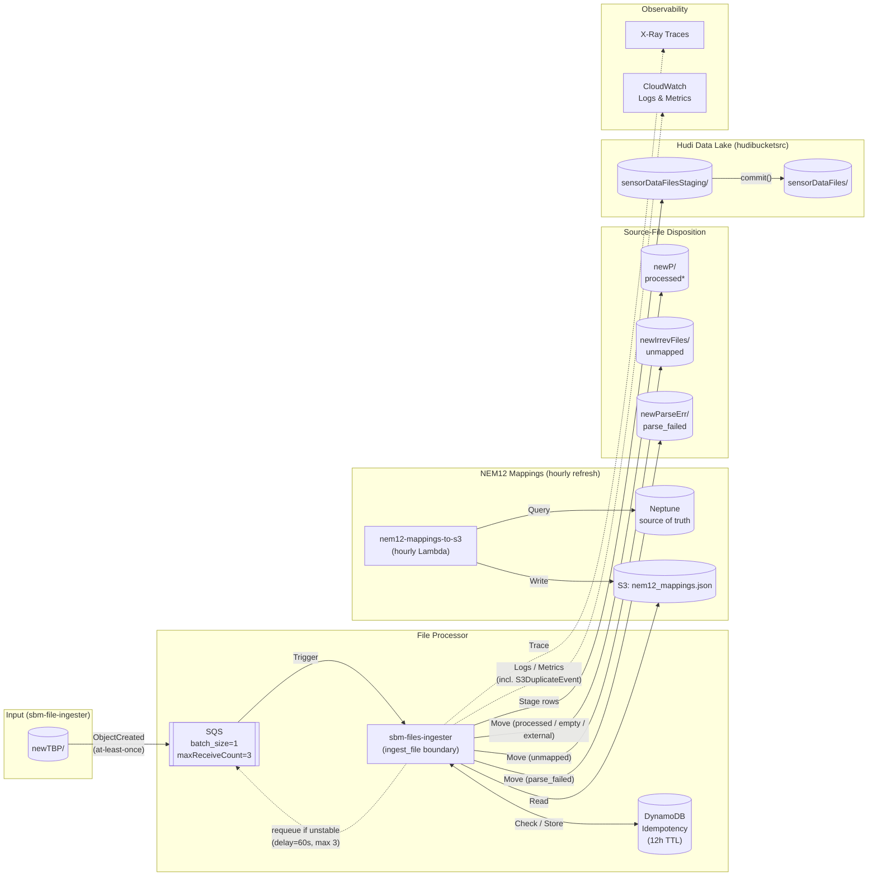

# sbm-ingester


Serverless file ingestion pipeline for building energy data. Processes NEM12/NEM13 meter data files and transforms them into a standard format for the SBM data lake.

## Table of Contents

- [Background](#background)
- [Install](#install)
- [Usage](#usage)
- [Architecture](#architecture)
- [Project Structure](#project-structure)
- [Scripts](#scripts)
- [Configuration](#configuration)
- [Testing](#testing)
- [Deployment](#deployment)
- [API](#api)
- [Maintainers](#maintainers)
- [Contributing](#contributing)

## Background

SBM Ingester is part of the Sustainable Building Manager (SBM) platform. It handles automated ingestion of energy meter data from multiple sources:

- **NEM12** - Australian interval meter data (30-minute intervals)
- **NEM13** - Accumulation meter data
- **Envizi** - Water and electricity CSV exports
- **Optima / BidEnergy** - Interval / demand / billing CSVs (4 exporter Lambdas)
- **RACV** - Elec CSV + Noosa Solar (Fronius inverter) CSV with SkySpark point IDs
- **Synergy WA** - WA Meter Data sentinel CSVs (no-data days)
- **Green Square ComX** - Schneider private wire meters

Files uploaded to S3 trigger an event-driven pipeline that parses, transforms, and maps meter readings to Neptune graph database sensor IDs.

### Key Features (v0.7.0)

- **Per-file ingest boundary** - `ingest_file` orchestrator wrapped by Powertools `@idempotent_function` (12 h TTL). All side effects live inside the boundary, so duplicate SQS deliveries hit the cache instead of replaying state changes.
- **Structured `ParserOutcome` contract** - Every parser returns a typed `(status, reason, dataframes, accumulators)` dataclass. `derive_final()` collapses post-processing counters into the final disposition. See `docs/ARCHITECTURE.md` for the full contract.
- **AWS Lambda Powertools** - Structured JSON logging, CloudWatch metrics, X-Ray tracing
- **Atomic Hudi-source writes** - `HudiSourceCsvWriter` with `flush()` / `commit()` / `abort()` lifecycle on a per-writer staging prefix
- **File Stability Check** - Two-HEAD streaming-uploader check; HEAD 404 → `S3DuplicateEvent` metric (at-least-once S3 → SQS handling)
- **Weekly Archiving** - Automated S3 file archiving with concurrent processing (50 workers)
- **Glue ETL Pipeline** - Apache Hudi data lake integration with automated batch import
- **Optima Exporter** - 4 Lambdas: NEM12 (manual/backup), interval (primary daily + monthly re-ingest), demand (daily + monthly re-ingest), billing (weekly trigger)
- **CIM Report Exporter** - Browser automation for AFDD ticket report downloads using Playwright (Docker/ECR)
- **Bunnings Billing Snapshot** - Weekly Athena snapshot of Bunnings billing data (10K+ sensors) pivoted to wide CSV for SkySpark

## Install

**Prerequisites:**
- Python 3.13+
- [uv](https://docs.astral.sh/uv/) package manager
- AWS CLI configured with credentials
- Terraform 1.0+ (for infrastructure)

```bash
# Clone repository
git clone <repository-url>
cd sbm-ingester

# Install dependencies
uv sync --all-extras

# Setup git hooks (optional but recommended)
./scripts/setup-lefthook.sh
```

**Git Hooks:** The project uses [lefthook](https://github.com/evilmartians/lefthook) for automated code quality checks. See [docs/LEFTHOOK.md](docs/LEFTHOOK.md) for details.

## Usage

### Local Development

```bash
# Run linter
uv run ruff check .

# Auto-fix lint issues
uv run ruff check --fix .

# Format code
uv run ruff format .

# Run tests
uv run pytest

# Run tests with coverage
uv run pytest --cov=src --cov-report=term-missing
```

### Manual File Processing

Upload files to S3 to trigger processing:

```bash
aws s3 cp meter_data.csv s3://sbm-file-ingester/newTBP/
```

### Refresh NEM12 Mappings

```bash
curl -X GET "https://<api-id>.execute-api.ap-southeast-2.amazonaws.com/prod/nem12-mappings" \
  -H "x-api-key: <your-api-key>"
```

## Architecture


```mermaid
flowchart LR
    subgraph Input["Input (sbm-file-ingester)"]
        S3_IN[("newTBP/")]
    end

    subgraph Processing["File Processor"]
        SQS[["SQS<br/>batch_size=1<br/>maxReceiveCount=3"]]
        Lambda["sbm-files-ingester<br/>(ingest_file boundary)"]
        DDB[("DynamoDB<br/>Idempotency<br/>(12h TTL)")]
    end

    subgraph Mappings["NEM12 Mappings (hourly refresh)"]
        MapLambda["nem12-mappings-to-s3<br/>(hourly Lambda)"]
        Neptune[("Neptune<br/>source of truth")]
        MapJSON[("S3: nem12_mappings.json")]
    end

    subgraph Disposition["Source-File Disposition"]
        S3_OK[("newP/<br/>processed*")]
        S3_IRR[("newIrrevFiles/<br/>unmapped")]
        S3_ERR[("newParseErr/<br/>parse_failed")]
    end

    subgraph DataLake["Hudi Data Lake (hudibucketsrc)"]
        S3_STAGE[("sensorDataFilesStaging/")]
        S3_DATA[("sensorDataFiles/")]
    end

    subgraph Observability
        XRay["X-Ray Traces"]
        CW["CloudWatch<br/>Logs & Metrics"]
    end

    S3_IN -->|"ObjectCreated<br/>(at-least-once)"| SQS
    SQS -->|"Trigger"| Lambda
    Lambda -. "requeue if unstable<br/>(delay=60s, max 3)" .-> SQS
    Lambda <-->|"Check / Store"| DDB
    Lambda -->|"Read"| MapJSON
    MapLambda -->|"Query"| Neptune
    MapLambda -->|"Write"| MapJSON
    Lambda -->|"Stage rows"| S3_STAGE
    S3_STAGE -->|"commit()"| S3_DATA
    Lambda -->|"Move (processed / empty / external)"| S3_OK
    Lambda -->|"Move (unmapped)"| S3_IRR
    Lambda -->|"Move (parse_failed)"| S3_ERR
    Lambda -.->|"Trace"| XRay
    Lambda -.->|"Logs / Metrics<br/>(incl. S3DuplicateEvent)"| CW
```

### Lambda Functions

| Function | Runtime | Memory | Timeout | Purpose |
|----------|---------|--------|---------|---------|
| `sbm-files-ingester` | Python 3.13 | 512 MB | 900s | Main processor - parses files, maps NMIs, writes to data lake |
| `sbm-files-ingester-redrive` | Python 3.13 | 128 MB | 600s | Re-triggers stuck files in `newTBP/` |
| `sbm-files-ingester-nem12-mappings-to-s3` | Python 3.13 | 128 MB | 60s | Hourly job - exports NEM12→Neptune ID mappings |
| `sbm-weekly-archiver` | Python 3.13 | 1024 MB | 600s | Weekly job (Monday UTC 00:00) - archives files with 50 concurrent workers |
| `sbm-glue-trigger` | Python 3.13 | 128 MB | 30s | Hourly job - triggers Glue ETL when files ≥ threshold |
| `optima-nem12-exporter` | Python 3.13 | 256 MB | 900s | Manual/backup - downloads BidEnergy NEM12 files to S3 (daily schedules retired in favour of `optima-interval-exporter`) |
| `optima-billing-exporter` | Python 3.13 | 128 MB | 120s | Weekly export (Saturday 7:00 AM Sydney, Bunnings + RACV) - triggers BidEnergy billing report (email delivery) |
| `optima-demand-exporter` | Python 3.13 | 256 MB | 900s | Daily export (2:30 PM Sydney, 3-day rolling window) + monthly re-ingest (1st @ 02:00 Sydney, `mode=previous_month`) - downloads BidEnergy Demand Profile CSVs (kW/kVa/PF) |
| `optima-interval-exporter` | Python 3.13 | 256 MB | 900s | Daily export (2:00 PM Sydney, 3-day rolling window) + monthly re-ingest (1st @ 01:00 Sydney, `mode=previous_month`) - downloads BidEnergy interval CSVs |
| `cim-report-exporter` | Python 3.13 | 1024 MB | 300s | Daily job (8 AM Sydney) - Playwright browser automation for CIM AFDD reports |
| `sbm-bunnings-billing-snapshot` | Python 3.13 | 512 MB | 900s | Weekly job (Sunday 08:00 Sydney) - Athena query on Hudi billing sensors, pivots to wide CSV at `s3://gegoptimareports/bunnings-billing/billing-latest.csv` for SkySpark consumption |

### Glue ETL Job

| Job | Workers | Timeout | Purpose |
|-----|---------|---------|---------|
| `DataImportIntoLake` | 5 (G.2X) | 24h | Imports CSV files from `sensorDataFiles/` into Apache Hudi data lake |

**Glue Flow:**
```
EventBridge (hourly) → Lambda (sbm-glue-trigger) → Glue Job (if files ≥ 10)
                                                       ↓
                                              Read CSVs from S3
                                                       ↓
                                              Upsert to Hudi table
                                                       ↓
                                              Archive to sensorDataFilesArchived/
```

### CIM Report Exporter

Uses Docker container image with Playwright for browser automation:

```
EventBridge (daily 8 AM Sydney) → Lambda (cim-report-exporter)
                                            ↓
                                   Launch headless Chromium
                                            ↓
                                   Login to CIM via Keycloak
                                            ↓
                                   Navigate to Actions report
                                            ↓
                                   Download CSV (90 days)
                                            ↓
                                   Send via SES email
```

**Deployment:** Docker image → ECR → Lambda (container image type)

### File Processing Outcomes

Every parser returns a `ParserOutcome` with one of 5 statuses; the file processor maps each status to a source-file destination:

| `ParserOutcome.status` | Destination | Description |
|---|---|---|
| `processed` | `newP/` | Parsed successfully and at least one row written to the Hudi source |
| `processed_empty` | `newP/` | File was understood but yielded no usable rows (e.g., vendor "no data available" sentinel, empty NEM envelope) |
| `processed_external` | `newP/` | Parser wrote rows to a non-Hudi destination (currently only Optima billing → `gegoptimareports`) |
| `unmapped` | `newIrrevFiles/` | Parsed and produced candidate rows, but no meter identifier resolved to a Neptune ID |
| `parse_failed` | `newParseErr/` | Caught `ParserError` / `ProcessingError` — deterministic content failure, cached for 12 h TTL so retries do not replay |

The status/reason combinations and the `derive_final()` disposition ladder are documented in [`docs/ARCHITECTURE.md`](docs/ARCHITECTURE.md). (Internal design specs live under `docs/superpowers/specs/` — gitignored; ask a maintainer for access.)

### S3 Archive Structure

Files are archived weekly using ISO week format:

```
sbm-file-ingester/
├── newP/
│   ├── (active files)
│   └── archived/
│       ├── 2026-W01/
│       ├── 2026-W02/
│       └── ...
├── newIrrevFiles/
│   └── archived/2026-WXX/
└── newParseErr/
    └── archived/2026-WXX/
```

The `sbm-weekly-archiver` Lambda runs every Monday and moves the previous week's files to the corresponding `archived/YYYY-WXX/` directory.

## Project Structure

```
sbm-ingester/
├── src/
│   ├── __init__.py              # Package metadata (version, author)
│   ├── functions/
│   │   ├── file_processor/      # Main ingester Lambda (per-file refactor)
│   │   │   ├── app.py           # SQS adapter + stability check + duplicate-event handling
│   │   │   ├── pipeline.py      # `ingest_file` orchestrator (idempotent boundary)
│   │   │   ├── csv_writer.py    # `HudiSourceCsvWriter` (flush/commit/abort lifecycle)
│   │   │   └── persistence.py   # `InstrumentedDynamoDBPersistenceLayer` (cache-hit logging)
│   │   ├── nem12_exporter/      # NEM12 → Neptune mappings exporter Lambda
│   │   │   └── app.py
│   │   ├── redrive_handler/     # Redrive Lambda
│   │   │   └── app.py
│   │   ├── weekly_archiver/     # Weekly archiver Lambda
│   │   │   └── app.py
│   │   ├── glue_trigger/        # Glue trigger Lambda
│   │   │   └── app.py
│   │   ├── optima_exporter/     # Optima/BidEnergy exporter (4 Lambdas)
│   │   │   ├── optima_shared/      # Auth, config, DynamoDB
│   │   │   ├── nem12_exporter/     # NEM12 CSV download Lambda (manual/backup)
│   │   │   ├── interval_exporter/  # Interval CSV download Lambda (primary daily source)
│   │   │   ├── demand_exporter/    # Demand profile CSV download Lambda
│   │   │   └── billing_exporter/   # Billing report trigger Lambda
│   │   └── cim_exporter/        # CIM AFDD report exporter (Docker)
│   │       ├── Dockerfile
│   │       ├── requirements.txt
│   │       ├── cim_shared/      # Config utilities
│   │       └── report_exporter/ # Playwright automation + emailer
│   ├── glue/
│   │   └── hudi_import/         # Glue ETL job (PySpark, Hudi upsert)
│   │       └── script.py
│   └── shared/
│       ├── __init__.py          # Public API exports
│       ├── common.py            # Constants (INPUT_BUCKET, HUDI_BUCKET, S3 prefixes, log groups)
│       ├── source_file.py       # `SourceFile` dataclass (idempotency key payload)
│       ├── audit.py             # Audit sidecar helpers
│       ├── nem_adapter.py       # NEM12/NEM13 parser adapter (nemreader)
│       └── parsers/             # Vendor-scoped non-NEM parser subpackages
│           ├── outcome.py       # `ParserOutcome` contract + `derive_final()`
│           ├── dispatcher.py    # `dispatch_non_nem()` cascade
│           ├── envizi/          # Water / electricity
│           ├── optima/          # Interval / demand / billing CSVs
│           ├── racv/            # RACV Elec + Noosa Solar (Fronius)
│           ├── synergy/         # Synergy WA Meter Data (sentinel handler)
│           └── green_square/    # Green Square ComX
├── tests/
│   └── unit/
│       ├── conftest.py          # Shared fixtures
│       ├── fixtures/            # Test data files
│       │   ├── nem12_*.csv      # NEM12/NEM13 sample meter data
│       │   └── optima_interval/ # Real BidEnergy interval CSVs (AU NMI, NZ ICP, multi-month, empty-data sentinel)
│       └── test_*.py            # Test modules (~785 tests)
├── scripts/
│   ├── process_nem12_locally.py            # Local NEM12 processing
│   ├── import_optima_config_to_dynamodb.py # Import Optima site config to DynamoDB
│   ├── backfill_country_to_dynamodb.py     # Backfill country field in DynamoDB
│   ├── import_billing_points.py            # Import billing point IDs
│   ├── import_demand_points.py             # Import demand point IDs
│   ├── generate_demand_points.py           # Generate demand-points CSV
│   ├── billing_neptune_helper.py           # Neptune query helpers for billing
│   ├── glue_delete_offcadence_rows.py      # Off-cadence row purge (Hudi SOP)
│   ├── glue_delete_offcadence_rows.sh      # Wrapper script for Glue purge job
│   ├── cleanup_configs/                    # Off-cadence purge configs (e.g. bunnings.conf)
│   ├── deploy.sh                           # Full deployment script
│   ├── deploy-lambda.sh                    # Local Lambda zip deployment
│   ├── deploy-cim-exporter.sh              # CIM Docker image deployment
│   └── setup-lefthook.sh                   # Git hooks setup
├── terraform/
│   ├── ingester.tf              # Lambda functions
│   ├── glue.tf                  # Glue job and trigger
│   ├── optima_exporter.tf       # Optima exporter Lambda, DynamoDB, Scheduler
│   ├── cim_exporter.tf          # CIM exporter Lambda, ECR, EventBridge Scheduler
│   ├── monitoring.tf            # Alarms and SNS
│   ├── logs.tf                  # CloudWatch Log Groups
│   └── ...                      # Other Terraform modules
├── docs/
│   ├── ARCHITECTURE.md          # Post-refactor architecture reference (per-file ingest)
│   ├── LEFTHOOK.md              # Git hook configuration
│   └── CLEANUP_OFFCADENCE_ROWS.md  # Off-cadence row purge SOP
└── pyproject.toml               # Project config (uv, ruff, pytest)
```

## Scripts

### Deploy Lambda

Local deployment script for quick iterations during development.

```bash
# Deploy specific Lambda
./scripts/deploy-lambda.sh ingester
./scripts/deploy-lambda.sh weekly-archiver
./scripts/deploy-lambda.sh glue-trigger

# Deploy all Lambdas
./scripts/deploy-lambda.sh all
```

**Available targets:** `ingester`, `redrive`, `nem12` / `nem12-mappings`, `archiver` / `weekly-archiver`, `optima` / `optima-exporter`, `all`

**Note:** `cim-exporter` uses its own script (`./scripts/deploy-cim-exporter.sh`) because it's a Docker container image via ECR, not a zip package. `glue-trigger` is not deployed via this script — it's a small Lambda that ships with the main ingester package or via Terraform.

### Process NEM12 Locally

Process NEM12 files locally and upload to S3 (bypasses SQS queue).

```bash
# Dry-run (preview without uploading)
uv run scripts/process_nem12_locally.py /path/to/file.csv --dry-run

# Upload to S3
uv run scripts/process_nem12_locally.py /path/to/file.csv
```

## Configuration

### Environment Variables

| Variable | Description | Default |
|----------|-------------|---------|
| `SQS_QUEUE_URL` | **Required** at import time — main queue URL for requeueing unstable files (KeyError on import otherwise) | _(required)_ |
| `INPUT_BUCKET` | Input S3 bucket (constant in `src/shared/common.py`, not env-driven) | `sbm-file-ingester` |
| `MAX_REQUEUE_RETRIES` | Max requeue attempts for unstable files (aligned with SQS `maxReceiveCount=3`) | `3` |
| `REQUEUE_DELAY_SECONDS` | SQS `DelaySeconds` when requeueing an unstable file | `60` |
| `CSV_FLUSH_ROW_THRESHOLD` | Rows to buffer in `HudiSourceCsvWriter` before flushing to S3 | `50000` |

### CloudWatch Log Groups

| Log Group | Purpose |
|-----------|---------|
| `sbm-ingester-execution-log` | Processing start/end timestamps |
| `sbm-ingester-error-log` | Application errors |
| `sbm-ingester-parse-error-log` | File parsing failures |
| `sbm-ingester-runtime-error-log` | Non-parse runtime issues |
| `sbm-ingester-metrics-log` | Daily metrics (file counts, monitor points) |

### AWS Resources

- **Region:** ap-southeast-2
- **S3 Buckets:** `sbm-file-ingester` (input), `hudibucketsrc` (output, with `sensorDataFilesStaging/` + `sensorDataFiles/` for two-phase commit)
- **SQS:** `sbm-files-ingester-queue` (1080s visibility, `batch_size=1`, `maxReceiveCount=3`), `sbm-files-ingester-dlq` (14 day retention)
- **DynamoDB:** `sbm-ingester-idempotency` (12h TTL, PAY_PER_REQUEST)
- **Neptune:** NEM12 ID → sensor ID mappings (exported hourly to S3 by `sbm-files-ingester-nem12-mappings-to-s3`)
- **SNS:** `sbm-ingester-alerts` (DLQ + error + duplicate-event-spike notifications)
- **ECR:** `cim-exporter` (Docker image repository)

## Testing

Tests use pytest with moto for AWS mocking. **Total: 785 tests** (20 deselected by default — module/class-level skips for follow-up cleanup).

```bash
# Run all tests
uv run pytest

# Run with verbose output
uv run pytest -v

# Run specific test file
uv run pytest tests/unit/test_nem_adapter.py

# Run with coverage report
uv run pytest --cov=src --cov-report=html
```

### Test Coverage

Coverage target: **≥90%** (enforced via lefthook pre-push). Run `uv run pytest --cov=src --cov-report=term-missing` for the latest per-file breakdown.

## Deployment

Deployment is automated via GitHub Actions on push to `main`. The CI/CD pipeline:
1. Builds and deploys 10 Lambda functions (9 zip + 1 Docker container)
2. Uploads Glue ETL script to S3
3. Builds and pushes CIM Exporter Docker image to ECR (incremental — only when `src/functions/cim_exporter/**` changes)

### Manual Deployment

```bash
# Build Lambda packages
cd src
zip -r ../ingester.zip functions/file_processor/ shared/

# Upload to S3
aws s3 cp ingester.zip s3://gega-code-deployment-bucket/sbm-files-ingester/

# Update Lambda
aws lambda update-function-code \
  --function-name sbm-files-ingester \
  --s3-bucket gega-code-deployment-bucket \
  --s3-key sbm-files-ingester/ingester.zip

# Upload Glue script
aws s3 cp src/glue/hudi_import/script.py \
  s3://aws-glue-assets-318396632821-ap-southeast-2/scripts/hudiImportScript
```

### Infrastructure (Terraform)

```bash
cd terraform
terraform init
terraform plan
terraform apply
```

## API

### GET /nem12-mappings

Manually triggers NEM12 mapping refresh.

**Request:**
```bash
curl -X GET "https://<api-id>.execute-api.ap-southeast-2.amazonaws.com/prod/nem12-mappings" \
  -H "x-api-key: <api-key>"
```

**Response:**
```json
{
  "statusCode": 200,
  "body": "Mappings refreshed successfully"
}
```

**Rate Limit:** 500 requests/day

## Maintainers

- [@zeyu-chen](https://github.com/zeyu-chen)

## Contributing

1. Create a feature branch from `main`
2. Make changes following the code style (enforced by ruff)
3. Add tests for new functionality
4. Ensure all tests pass: `uv run pytest`
5. Ensure lint passes: `uv run ruff check .`
6. Submit a pull request
